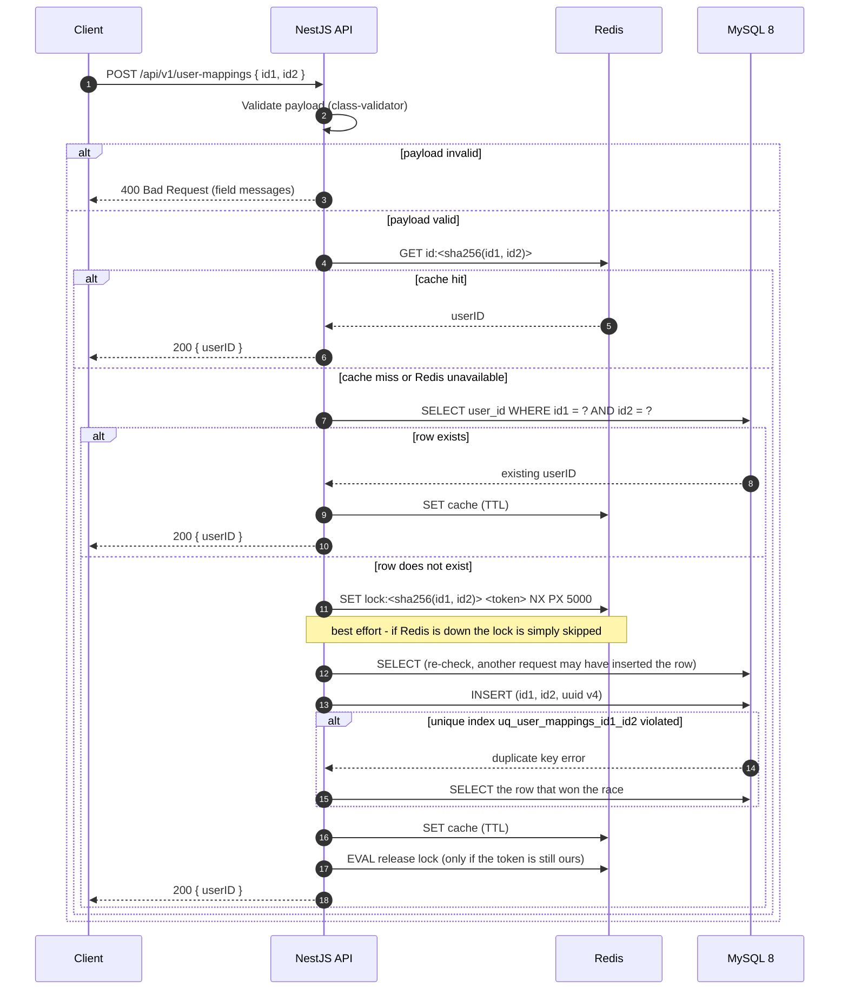

# Main flow: POST /api/v1/user-mappings

## Notes

* **MySQL is the source of truth.** Redis only shortens the path: a cache hit skips
  the database read, and the lock keeps concurrent requests out of the insert path.
* **The unique index is the guarantee.** Every insert is a single statement, and the
  database rejects the loser of a race with a duplicate key error. The loser then
  reads the winning row and returns its `userID`, so both callers receive the same
  answer and exactly one row exists.
* **Redis failures are not request failures.** Every Redis call is wrapped so that a
  timeout, an outage or an empty `REDIS_URL` degrades to "no cache, no lock" while the
  request still succeeds through MySQL.
* **The table is append-only**, so a cached `userID` can never become stale: a row is
  written once and never updated or deleted by the application.
